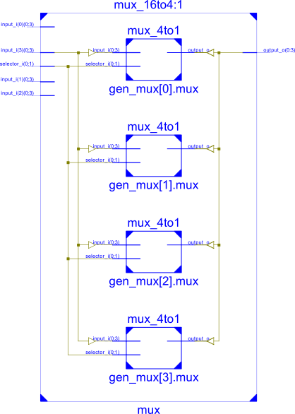
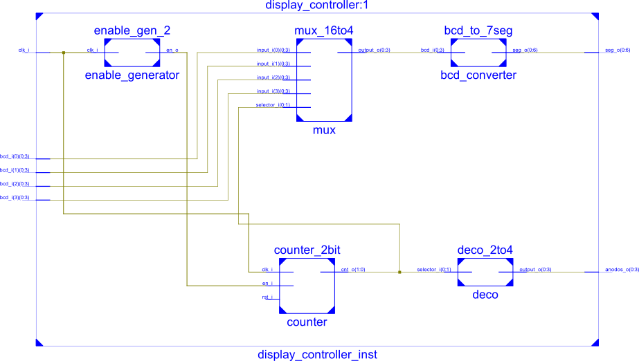
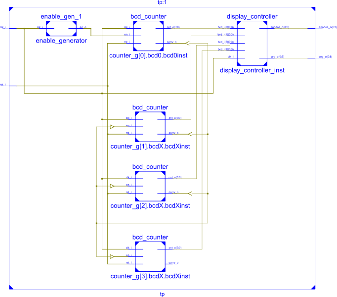

## Componentes sintetizados

### Multiplexor 16 a 4

### Display controller

### Contador final

## Simulaciones

### Simulación del contador BCD

El contador BCD cuenta de 0 a 9, para luego emitir  carry out y reanudar la cuenta. En la simulación también se agregó una señal de reset al llegar al número 11.

### Simulación del Display controller

## Componentes utilizados

### Reporte cuantitativo de la síntesis.

~~~
HDL Synthesis Report

Macro Statistics
# ROMs                                                 : 2
 16x7-bit ROM                                          : 1
 4x4-bit ROM                                           : 1
# Adders/Subtractors                                   : 7
 3-bit adder                                           : 1
 32-bit adder                                          : 4
 32-bit subtractor                                     : 2
# Counters                                             : 2
 32-bit down counter                                   : 2
# Registers                                            : 11
 1-bit register                                        : 6
 3-bit register                                        : 1
 32-bit register                                       : 4
# Multiplexers                                         : 4
 1-bit 4-to-1 multiplexer                              : 4

Advanced HDL Synthesis Report

Macro Statistics
# ROMs                                                 : 2
 16x7-bit ROM                                          : 1
 4x4-bit ROM                                           : 1
# Adders/Subtractors                                   : 7
 3-bit adder                                           : 1
 32-bit adder                                          : 4
 32-bit subtractor                                     : 2
# Counters                                             : 2
 32-bit down counter                                   : 2
# Registers                                            : 137
 Flip-Flops                                            : 137
# Multiplexers                                         : 4
 1-bit 4-to-1 multiplexer                              : 4

===============================================================
Final Register Report

Macro Statistics
# Registers                                            : 199
 Flip-Flops                                            : 199
~~~

### Porcentual del dispositivo utilizado

~~~
Device utilization summary:
---------------------------

Selected Device : 3s200ft256-4 

 Number of Slices:                      235  out of   1920    12%  
 Number of Slice Flip Flops:            199  out of   3840     5%  
 Number of 4 input LUTs:                334  out of   3840     8%  
 Number of IOs:                          13
 Number of bonded IOBs:                  13  out of    173     7%  
 Number of GCLKs:                         1  out of      8    12%  
~~~

## Frecuencia máxima del reloj

~~~
Timing Summary:
Speed Grade: -4
   Minimum period: 12.264ns (Maximum Frequency: 81.541MHz)
~~~
